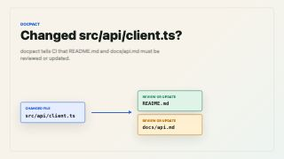

# docpact

[](https://crates.io/crates/docpact)
[](https://docs.rs/docpact)
[](./LICENSE)
[](https://github.com/Biaoo/docpact/actions/workflows/test.yml)
[](https://github.com/Biaoo/docpact/actions/workflows/release.yml)

Changed `src/api/client.ts`?

`docpact` tells CI that `README.md` and `docs/api.md` must be reviewed or updated before the change can merge.

`docpact` is a standalone Rust CLI for deterministic, diff-driven documentation governance in AI-assisted software teams. It does not generate documentation and it does not ask an LLM to decide whether docs are stale. Repositories declare documentation obligations in config; `docpact` enforces those obligations from an explicit diff.

## Install

```bash
cargo install docpact
```

Run from source:

```bash
cargo run -- <command>
```

## 30-second demo

[](./assets/docpact-promotion-demo.mp4)

[Watch the 30-second demo video](./assets/docpact-promotion-demo.mp4)

Start with a `.docpact/config.yaml` rule:

```yaml
version: 1
layout: repo
repo:
  id: sample-sdk
  owner: sample-sdk
rules:
  - id: api-surface
    scope: repo
    repo: sample-sdk
    triggers:
      - path: src/api/**
        kind: code
    requiredDocs:
      - path: README.md
        mode: review_or_update
      - path: docs/api.md
        mode: review_or_update
    reason: API changes must refresh the public contract and docs.
```

Run `lint` against a concrete diff:

```bash
docpact lint --root . --files src/api/client.ts --mode enforce
```

Example output:

```text
Docpact lint: blocking problems found.
Summary: total=2, active=2, suppressed_by_baseline=0, waived=0, coverage=ok, uncovered=0, freshness=ok, stale_docs=0, critical_stale_docs=0, invalid_review_references=2, page=1/1
Problem types: missing-review=2
Top rules: api-surface=2
- [d001] missing-review: README.md via rule api-surface; action: touch_required_doc; reason: required_doc_not_touched; mode: review_or_update
- [d002] missing-review: docs/api.md via rule api-surface; action: touch_required_doc; reason: required_doc_not_touched; mode: review_or_update
Next: run `docpact diagnostics show --report <artifact> --id d001` for full context, then apply the suggested action.
```

Handle the obligation by updating the docs or recording explicit review evidence:

```bash
docpact review mark --root . --path README.md
git add README.md docs/api.md
docpact lint --root . --staged --mode enforce
```

## GitHub Actions

```yaml
- uses: Biaoo/docpact@v0.1.6
  with:
    version: 0.1.6
    args: >
      lint
      --root .
      --base ${{ github.event.pull_request.base.sha }}
      --head ${{ github.sha }}
      --mode enforce
```

Reference workflows:

- [examples/github-actions/pr-lint.yml](./examples/github-actions/pr-lint.yml)
- [examples/github-actions/pr-lint-with-adoption-controls.yml](./examples/github-actions/pr-lint-with-adoption-controls.yml)
- [examples/github-actions/coverage-audit.yml](./examples/github-actions/coverage-audit.yml)
- [examples/github-actions/freshness-audit.yml](./examples/github-actions/freshness-audit.yml)

## What docpact answers

It helps teams and agents answer three practical questions:

- before coding: what documents should I read first?
- after coding: what documentation should this change have reviewed or updated?
- ongoing: which governed documents have gone stale?

`docpact` closes that loop with deterministic commands:

- `route` helps decide what to read before coding
- `lint` enforces which governed docs should have been reviewed or updated after coding
- `freshness` detects governed docs that may no longer be trustworthy
- `render` exposes short, read-only summaries over catalog, ownership, navigation, and workspace context

## Quick Start

1. Start from one of the bundled config examples:
   - [examples/repo-config.yaml](./examples/repo-config.yaml)
   - [examples/workspace-config.yaml](./examples/workspace-config.yaml)
   - [examples/workspace-child-config.yaml](./examples/workspace-child-config.yaml)
2. Copy the right shape into the target repository as `.docpact/config.yaml`.
3. Validate the config.
4. Run `lint` against an explicit diff source.

```bash
docpact validate-config --root /path/to/repo
docpact validate-config --root /path/to/repo --strict
docpact validate-config --root /path/to/repo --strict --format json
docpact lint --root /path/to/repo --files src/api/client.ts,README.md --format text
```

`lint` always needs one explicit diff source. Use one of:

- `--files <csv>`
- `--staged`
- `--worktree`
- `--merge-base <ref>`
- `--base <sha> --head <sha>`

## Why docpact

AI coding tools make code changes cheaper. They also make documentation drift cheaper.

In agentic coding workflows, that usually breaks down in three places:

- before coding: an agent does not know which documents it should read first, so it either loads too much, relies on coarse pointers, or skips discovery entirely
- after coding: an agent does not know which documents should have been reviewed or updated as a consequence of the change
- ongoing: an agent treats documentation as authoritative input, but has no built-in signal for whether that documentation has silently gone stale

`docpact` stays deterministic. It does not replace governance decisions with AI inference, and it does not hide state in background services or opaque caches.

Public design principles:

- [docs/design-principles.md](./docs/design-principles.md)
- [docs/modeling-boundary.md](./docs/modeling-boundary.md)

## Core Commands

### Validate configuration

```bash
docpact validate-config --root /path/to/repo
docpact validate-config --root /path/to/repo --strict
docpact validate-config --root /path/to/repo --strict --format json
```

### Check a concrete change

```bash
docpact lint --root /path/to/repo --files src/api/client.ts,README.md --format json --output .docpact/runs/latest.json
```

`lint --format json` stdout is a paged `docpact.lint-report.v1` report. The saved diagnostics artifact is the full drill-down store used by `diagnostics show`.

### Drill into one finding

```bash
docpact diagnostics show --report .docpact/runs/latest.json --id d001 --format json
```

For rule-match inspection without replaying lint:

```bash
docpact explain src/api/client.ts --root /path/to/repo --format json
```

### Record completed review evidence

```bash
docpact review mark --root /path/to/repo --path docs/api.md
```

or, when coming from one explicit lint finding:

```bash
docpact review mark --root /path/to/repo --report .docpact/runs/latest.json --id d001
```

### Audit governance coverage

```bash
docpact coverage --root /path/to/repo --format json
```

### Audit document freshness

```bash
docpact freshness --root /path/to/repo --format json
```

### Route reading before coding

```bash
docpact route --root /path/to/repo --paths src/payments/** --format json
docpact route --root /path/to/repo --module src/payments --format text
docpact render --root /path/to/repo --view routing-summary --format text
docpact route --root /path/to/repo --intent payments --format json
```

### Render derived summaries

```bash
docpact render --root /path/to/repo --view catalog-summary --format json
docpact render --root /path/to/repo --view routing-summary --format text
docpact render --root /path/to/repo --view navigation-summary --paths src/payments/** --format text
```

## What Belongs In Config, Source Docs, and Derived Views

Use this rule of thumb before editing a `docpact`-governed repository:

- put deterministic governance facts in `.docpact/config.yaml`
- keep explanation, rationale, troubleshooting, and runbook material in source docs
- treat `render` output as a read-only derived-view layer over existing authoritative facts

Examples:

- `rules`, `ownership`, and `routing.intents` belong in config
- ADRs, exception handling guidance, and troubleshooting guides belong in source docs
- ownership summaries and navigation summaries belong in derived views

`render` is not a new source of truth. It is a compact entry surface over facts that already live in config or another authoritative file.

For the full decision order, examples, and anti-patterns, see [docs/modeling-boundary.md](./docs/modeling-boundary.md).

## Adoption Controls

`docpact` supports explicit adoption controls for repositories that cannot enforce all existing debt immediately.

Create and apply a baseline:

```bash
docpact baseline create --report .docpact/runs/latest.json --output .docpact/baseline.json
docpact lint --root /path/to/repo --files src/api/client.ts,README.md --baseline .docpact/baseline.json
```

Add a waiver for one explicit finding:

```bash
docpact waiver add \
  --report .docpact/runs/latest.json \
  --id d001 \
  --reason "temporary exception during migration" \
  --owner "team-docs" \
  --expires-at 2026-05-31 \
  --output .docpact/waivers.yaml
```

Then apply it during lint:

```bash
docpact lint --root /path/to/repo --files src/api/client.ts,README.md --waivers .docpact/waivers.yaml
```

Use waivers sparingly. They are temporary, explicit exceptions, not a default suppression path.

## Repository CI Workflows

- [test.yml](./.github/workflows/test.yml): minimal PR and default-branch test CI
- [release.yml](./.github/workflows/release.yml): tag-driven crates.io publish and GitHub Release

## Skills

This repository also ships official workflow skills under [skills/](./skills):

- [skills/README.md](./skills/README.md)
- [skills/docpact/SKILL.md](./skills/docpact/SKILL.md): direct workflow entrypoint
- [skills/docpact-governance/SKILL.md](./skills/docpact-governance/SKILL.md): governance-maintainer entrypoint

## Current Capabilities

Current `docpact` capabilities include:

- repo and workspace config loading
- explicit workspace profile inheritance and child overrides
- deterministic trigger-to-required-doc matching
- metadata checks on governed Markdown and YAML docs
- diff coverage and repository coverage audit
- repository freshness audit
- deterministic routing with paths, module scope, and controlled intents
- read-only derived render views for catalog, ownership, navigation, and workspace summaries
- report-backed diagnostics drill-down
- explicit review-evidence recording
- baseline and waiver lifecycle
- list-rules and doctor inspection commands
- text, JSON, and SARIF reporting
- official GitHub Action wrapper
- official skills for direct workflow and governance maintenance

Still deferred:

- symbol-level drift checks
- executable documentation hooks
- AI-assisted semantic review
- documentation generation from code
